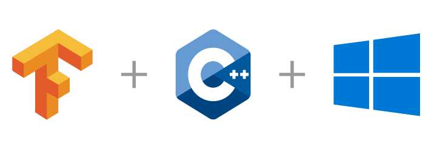

# TensorFlow C API Examples



TensorFlow C API examples for Windows, Linux, and macOS, with a small C++ helper library.

## Requirements

- CMake 3.20 or newer and a C++17 compiler.
- Python with pip; CI uses Python 3.12.
- A 64-bit platform supported by the TensorFlow wheel.

## Build and test

```sh
git clone --depth 1 https://github.com/Neargye/hello_tf_c_api
cd hello_tf_c_api
```

### Windows (Visual Studio)

```sh
cmake -S . -B build -A x64
cmake --build build --config Release
ctest --test-dir build --output-on-failure -C Release
```

### Linux and macOS

```sh
cmake -S . -B build -DCMAKE_BUILD_TYPE=Release
cmake --build build
ctest --test-dir build --output-on-failure
```

CMake downloads the TensorFlow 2.21.0 wheel into `build/_deps/tensorflow/python` and links its native libraries. On Windows, it also copies the runtime DLLs. You do not need to install TensorFlow into your Python environment to build the C++ examples.

The repository includes `models/graph.pb`. Run examples from the `build` directory so they can find its copy: `./Release/repeated_inference.exe` on Windows or `./repeated_inference` on Linux/macOS.

### Build options

Pass these options to `cmake -S . -B build`:

- `-DHELLO_TF_BUILD_EXAMPLES=OFF`: skip example executables.
- `-DBUILD_TESTING=OFF`: skip tests.
- `-DTENSORFLOW_ROOT=/path/to/tensorflow -DHELLO_TF_FETCH_TENSORFLOW=OFF`: use an existing wheel extraction. Headers must be under `<root>/python/tensorflow/include`, with native libraries under `<root>/python/tensorflow` or its `python` subdirectory. CMake does not overwrite an external root.

OpenCV is optional. CMake builds and tests the OpenCV example when it finds the library.

## Examples

- [TensorFlow version](src/hello_tf.cpp), [load a graph](src/load_graph.cpp).
- [Create a tensor](src/create_tensor.cpp), [allocate a tensor](src/allocate_tensor.cpp), [string tensors](src/create_string_tensor.cpp).
- [Run a session](src/session_run.cpp), [run a target operation](src/target_operation.cpp).
- [Helper API](src/interface.cpp), [batch inference](src/batch_interface.cpp), [repeated inference](src/repeated_inference.cpp).
- [Image tensors](src/image_example.cpp), [image files with OpenCV](src/opencv_image_file_example.cpp).
- [Tensor information](src/tensor_info.cpp), [graph information](src/graph_info.cpp).

## Helper API

See [tf_utils.hpp](src/tf_utils.hpp) for declarations. Within this CMake project, link the helpers with:

```cmake
target_link_libraries(your_target PRIVATE hello_tf_utils)
```

For raw C API examples, use the project's `target_link_tensorflow(your_target)` function. There is no installable CMake package.

- `CreateTensor(dims, values)` infers the TensorFlow type from the vector element type. Use `CreateStringTensor` for strings.
- Reader overloads taking a result reference return `TF_Code` and leave the result unchanged on error. They distinguish errors from valid empty values.
- The checked `GetTensorShape` writes `nullopt` for unknown rank, an empty vector for a scalar, and `-1` for unknown dimensions.
- `RunSession` requires output slots initialized to `nullptr`. Delete returned tensors and reset the slots before reuse.

## More

- [Prepare models](doc/prepare_models.md): GraphDef, operation names, and checkpoints.
- [Runtime and performance](doc/optimizing.md): resource reuse and measurement.
- [Create a Windows import library](doc/create_lib_file_from_dll_for_windows.md): only for manual linking.

## Licensed under the [MIT License](LICENSE)
